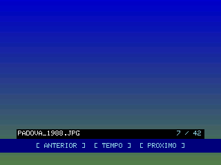
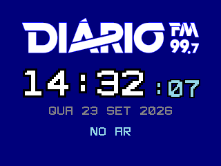
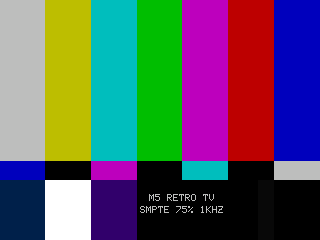

# FRUIT JAM RETRO TV — Adafruit Fruit Jam (RP2350B)

**[English](#english) · [Português](#português)**

Arduino firmware that turns an **Adafruit Fruit Jam** into a retro TV: MJPEG +
WAV playback from microSD over DVI (640×480, 320×240 logical frame), an
air-traffic radar, an iPod-style music player, a photo slideshow, internet radio,
SMPTE bars and a clone of the 1980s *Weather Channel Local Forecast*.

*Firmware Arduino que transforma um **Adafruit Fruit Jam** numa TV retrô:
reprodução de MJPEG + WAV do microSD pela saída DVI (640×480, quadro lógico de
320×240), radar de tráfego aéreo, player de música estilo iPod, apresentação de
fotos, rádio pela internet, barras SMPTE e um clone do "Local Forecast" do
Weather Channel dos anos 80.*

This is a **fork of [m5-retro-tv](https://github.com/eliel9012/m5-retro-tv)**,
which runs on an M5Stack Core2 with the Module13.2 RCA and outputs NTSC composite
directly. Same screens, same card layout, different hardware.

*Este é um **fork do [m5-retro-tv](https://github.com/eliel9012/m5-retro-tv)**,
que roda num M5Stack Core2 com o Module13.2 RCA e gera vídeo composto NTSC
direto. Mesmas telas, mesmo cartão, outro hardware.*

> **Status — nothing has been tested on the device yet.** The port compiles
> against the Fruit Jam's libraries; whether the picture comes up, the colours
> are right and the audio plays is still to be checked on real hardware. See
> [`PLANO_E_REVISAO.md`](PLANO_E_REVISAO.md) for the physical test plan.
>
> ***Status — nada foi testado no aparelho ainda.*** *O port compila contra as
> bibliotecas do Fruit Jam; se a imagem sobe, se as cores estão certas e se o
> som toca ainda precisa ser conferido no hardware. O roteiro de teste físico
> está no [`PLANO_E_REVISAO.md`](PLANO_E_REVISAO.md).*

---

## Screens · Telas

320×240 renders, scaled 2×, produced by the SDL screen simulator in `sim/` —
the **same LovyanGFX rasterizer and the same bitmap fonts** the firmware uses, so
they are not mockups. Regenerate with `./sim/build/m5sim --png docs/screens`.
On the device the frame is doubled to 640×480.

*Renders 320×240 (escalados 2×) gerados pelo simulador de telas em `sim/` — o
**mesmo rasterizador LovyanGFX e as mesmas fontes bitmap** do firmware, portanto
não são mockups. Regenere com `./sim/build/m5sim --png docs/screens`. No
aparelho o quadro é dobrado para 640×480.*

| Home · Início | Library · Biblioteca | Playback · Reprodução |
|---|---|---|
|  |  |  |

| Radar | Weather · Previsão | 3-day · 3 dias |
|---|---|---|
|  |  |  |

| Settings · Configurações | System · Sistema | Network · Rede |
|---|---|---|
|  |  |  |

| Music · Música | Now playing | Portal | Error · Erro |
|---|---|---|---|
|  |  |  |  |

| Photos · Fotos | Radio · Rádio | Test pattern · Padrão de teste |
|---|---|---|
|  |  |  |

The test pattern and radio renders call the firmware's own `TestPattern.h` and
`RadioScreen.h`. The photo render is the only partial one: the simulator does not
link JPEGDEC, so the frame and caption are real and the picture behind them is a
synthetic gradient.

*Os renders do padrão de teste e do rádio chamam o `TestPattern.h` e o
`RadioScreen.h` do próprio firmware. O das fotos é o único parcial: o simulador
não linka o JPEGDEC, então a moldura e a legenda são reais e a imagem atrás delas
é um degradê sintético.*

---

# English

## What you need

- An **Adafruit Fruit Jam** (RP2350B, 8 MB PSRAM, ESP32-C6 Wi-Fi coprocessor
  running Adafruit's NINA firmware).
- A **microSD card**, FAT32.
- A monitor or TV with an **HDMI/DVI input** and a cable. The connector is shaped
  like HDMI; the signal is DVI 640×480 at 60 Hz, which practically every HDMI
  display accepts.
- For sound: **headphones, amplified speakers or the TV's audio input** on the
  3.5 mm jack, or the Fruit Jam's own speaker. **DVI carries no audio**, so the
  TV stays silent through the video cable.
- For a **CRT**: an **HDMI → AV (composite) converter**. Set it to **NTSC** —
  Brazilian PAL-M sets generally accept NTSC, while plain PAL comes out in black
  and white or rolling. Take the audio from the 3.5 mm jack to the TV's RCA audio
  inputs (a 3.5 mm → 2×RCA cable), since the converter gets none over HDMI.

## Repository layout

- Root: the main firmware (every screen).
- `weather/`: alternative firmware, a separate self-contained PlatformIO project —
  just the *Local Forecast* clone (Open-Meteo + ticker + smooth jazz on loop).
  See `weather/README.md`.
- `include/fj/`, `src/fj/`: the Fruit Jam platform layer — DVI, DAC, SD, Wi-Fi,
  buttons, and the ESP32→RP2350 compatibility shims.
- `sim/`: SDL screen simulator (LovyanGFX on the desktop).
- `tools/`: `prepare_video.py` converts a film into MJPEG+WAV, `prepare_photos.py`
  converts photos into the only JPEG shape the device can decode.
- `PORTING.md`: the rules of the port. `AGENTS.md`: firmware architecture,
  hardware constraints and known traps. Start there before changing code.
- `PINOUT.md`: the pins the firmware uses.

## Video output

The RP2350's HSTX peripheral generates **DVI at 640×480, 60 Hz**. The firmware
draws a **320×240 RGB565** frame that the hardware doubles on both axes. 320×240
is what the whole firmware was designed around (safe area, bitmap fonts, OSD,
forecast), and a 640×480 RGB565 framebuffer would be 614 KB — more than all of the
RP2350's SRAM. The 153,600-byte 320×240 frame lives in SRAM and **is** the
drawing canvas: no copy, no flush.

Text, rules and bands stay inside the **safe area** (`crt::SAFE_*` in
`include/SafeArea.h`, ~7% of each edge). A monitor shows the whole raster, so
there the margin just reads as background; through an HDMI→AV converter on a CRT
it is what keeps text out of the overscan. The background always fills the whole
frame, so there are no black bars.

## Building and flashing

Python 3.9 or newer and internet access are needed on the first build.

```sh
cd fruitjam-retro-tv
python3 -m venv .venv
.venv/bin/pip install platformio==6.1.19
.venv/bin/pio run                # main firmware
.venv/bin/pio run -d weather     # standalone forecast
```

The platform is Max Gerhardt's community `platform-raspberrypi` with Earle
Philhower's arduino-pico core — PlatformIO's official `raspberrypi` platform has
no RP2350. Libraries are pinned by commit in `platformio.ini`.

To flash, put the board in **bootloader mode**: hold **BOOT** (button 1 doubles
as BOOT) and tap **RESET**. It shows up as a USB drive named `RP2350`. Then either:

```sh
.venv/bin/pio run --target upload
.venv/bin/pio device monitor       # serial console, 115200 baud
```

or copy `.pio/build/fruitjam/firmware.uf2` onto the `RP2350` drive by hand. The
board reboots into the firmware when the copy finishes.

Because button 1 is also BOOT, **holding it while the board resets** lands you in
the bootloader instead of the firmware.

No access to the PlatformIO registry? See `PORTING.md` §4 for a
`platformio_local.ini` that builds from locally cloned libraries.

## Preparing the card

Format the card as **FAT32**. The firmware creates what is missing under
`/M5RETRO/` — the same folder as upstream, so one card works in both devices:

```text
/M5RETRO/
  videos/<program>/   meta.json, video.mjpeg, audio.wav  (and optionally video.srt)
  music/<artist>/<album>/   .mp3 / .wav, cover.jpg
  fotos/              .jpg
  config/             settings.json, secrets.json  (written by the Wi-Fi portal)
```

The card is read over SDIO on its own bus; the socket's card-detect switch is
wired too.

## Preparing videos

The player reads concatenated baseline JPEGs and 16-bit stereo 22,050 Hz PCM WAV.
It does not read MP4 directly. The bundled converter uses FFmpeg and FFprobe from
your PATH:

```sh
python3 tools/prepare_video.py /path/movie.mp4 /path/new-program --title "My film"
```

Copy the resulting folder to `M5RETRO/videos/new-program/`. It contains:

```text
meta.json
video.mjpeg
audio.wav
```

The default is now **320×240 (full screen) at 15 fps**, preserving aspect ratio
with black bars. `--size 240x160` gives the smaller upstream default, which costs
less to decode and still fits entirely inside a CRT's safe area. `--fps` accepts
10 to 30; `--quality` goes from 2 to 15, lower values producing larger JPEGs.
**How fast the Fruit Jam decodes has not been measured** — use `diag bench` on the
device before trusting 320×240 at 30 fps.

The converter never replaces an existing folder. It validates size and frame
count, inserts silence when the video has no audio, and pads short audio to the
video duration. Each JPEG must be at most 128 KiB. `meta.json` is optional when
the files are named `video.mjpeg` and `audio.wav` and the rate is 15 fps.

## Music (MP3/WAV)

The home menu has a **MUSICA** entry, an iPod-style player that browses folders
on the card:

```text
/M5RETRO/music/
  Artist/
    Album/
      cover.jpg  (or folder.jpg)   <- album art, shown on the "now playing" screen
      track.mp3                    <- MP3 (128/192/320 kbps, 44100 Hz) via libhelix
      track.wav                    <- WAV PCM 16-bit 22050 Hz stereo
```

`.mp3` is decoded in software and resampled to 22050 Hz. ID3v1/v2 tags
(title/artist/album/year) appear on screen, with accents normalised to ASCII by
`include/Ascii.h`. Album art comes from `cover.jpg`/`folder.jpg` or from the
`APIC` frame embedded in the MP3. Test files are in `test-music/` — copy them to
`/M5RETRO/music/`.

## Photos

`/M5RETRO/fotos`, `.jpg`/`.jpeg`, auto-advancing with a configurable dwell (3 /
5 / 10 / 30 s). Convert before copying:

```bash
python3 tools/prepare_photos.py ~/Pictures/trip ~/Downloads/M5RETRO-photos
```

The target is **320×240 baseline JPEG, 4:2:0, `-q:v 5`**, about 8 KB each. That
is not a preference: the three limits below were measured upstream with the same
JPEGDEC this firmware uses.

- **4:4:4 chroma does not decode** (`JPEG_DECODE_ERROR`).
- **Progressive JPEG fails silently.** `decode()` returns success but draws only
  40×30 pixels (the first scan's DC coefficients). Most web exporters emit
  progressive by default. The converter checks the SOF marker of every file.
- **128 KB ceiling**, from `MAX_JPEG`. A phone photo is 0.5–5 MB.

## Internet radio

A fixed station table (`RadioStream.h`). Plain HTTP with `Icy-MetaData: 1`; the
inline metadata blocks are removed from the stream at exactly `icy-metaint`, and
`StreamTitle` feeds the on-screen ticker. The socket lives on the ESP32-C6 and is
read block by block; the ring buffer is in PSRAM, and decoding reuses the music
player's libhelix. The screen shows the station logo, a large local clock, the
date and the connection state. Video is stopped while the radio plays.

## Weather forecast

Two pages — current conditions and a three-day forecast — alternating every
10 s with Weather Star 4000 transitions. Data comes from **Open-Meteo**
(`api.open-meteo.com`), public, keyless, ~800-byte response. Set latitude and
longitude in the Wi-Fi portal. The standalone `weather/` firmware shows only this
screen.

## Aircraft radar

The radar queries an ADS-B API you configure in the portal (base URL, endpoint,
authentication mode and token). The response may be an array, or an object with
`items`/`aircraft`/`data` holding one; latitude and longitude are mandatory,
altitude in feet and speed in knots. The query runs in its own task and only
starts on the radar screen. With the centre still at 0,0, the average of the
received positions is used as a temporary centre.

**TLS runs inside the ESP32-C6** and validates against the NINA firmware's own
root bundle. `/M5RETRO/config/ca.pem`, used upstream, is **ignored** here: a server
with a private or self-signed CA will not validate.

## Wi-Fi setup (portal)

Playback works without Wi-Fi. Under **CONFIGURAÇÕES → CONFIGURAR REDE** the
Fruit Jam opens its own access point; the screen shows the network name, password
and address. Connect a phone or computer to it and open that address (normally
`http://192.168.4.1`). If the phone does not pop the page up by itself, type the
address.

Leaving the password/token blank keeps the existing value for the same network;
**REDE SEM SENHA** clears it for an open network. The test button checks the
Wi-Fi connection only — it does not claim the internet or the API work. The portal
closes after ten idle minutes. Settings are written with a `.bak` copy that is
recovered on the next boot if a write is interrupted.

## File transfer over Wi-Fi

**TRANSFERIR ARQUIVOS** turns the device into a small upload server on your
network. The screen shows the IP, a user and a one-time password; open the IP in
a browser and send videos, music or photos straight to the card. Uploads go to a
`.part` file and are only renamed when complete, and interrupted uploads resume.
Photos that are too large or not baseline are rejected with a message. Plain
HTTP, no TLS: it is meant for your LAN, and the password is only valid while the
screen is open.

## Channel mode, sleep timer, subtitles, test pattern

- **CONFIGURAÇÕES → MODO CANAL**: `DESLIGADO` stops at the end, `EM ORDEM` plays
  the next programme, `ALEATORIO` shuffles without repeats. An "A SEGUIR" card
  names what is coming.
- **CONFIGURAÇÕES → DESLIGAR EM**: 15 / 30 / 60 / 90 / 120 minutes. Any button
  restarts the countdown.
- **Subtitles**: a `.srt` next to the video (`video.mjpeg` → `video.srt`) is shown
  as line-21 style captions, timed by the audio clock.
- **Test pattern**: full-frame SMPTE bars plus a 1 kHz tone at −20 dBFS; OK
  cycles bars → sign-off slate → snow. On a CRT behind a converter, it shows
  exactly how much the tube crops. It is also the first thing to check on a new
  board: it is how you tell whether the colours are right.

## Clock

The Fruit Jam has **no battery-backed RTC**. The time comes only from NTP, via
the ESP32-C6, once Wi-Fi connects; until then the clock shows `--:--`. The time
zone is `<-03>3` (UTC−3, no DST, as in Brazil since 2019). **SISTEMA** shows where
the time came from.

## Controls

Three physical buttons: **A** (button 1) = left / previous, **B** (button 2) =
select, **C** (button 3) = right / next. The legend bar at the bottom of every
screen says what each one does there — there is no second screen any more.

- Hold **B** 0.7 s and release: back. Hold 1.5 s: home.
- Hold **A and C together**: home (it replaces the Core2's power button).
- Player: A/C change programme, B pauses and resumes.
- **Audio output** (CONFIGURAÇÕES → SAIDA AUDIO): **TV (P2)** = the 3.5 mm jack,
  **ALTO-FALANTE** = the board's speaker, or mute. Saved on the card. Volume 0 to
  100% on either.
- **DESLIGAR** (home menu) is a *soft-off*: the Fruit Jam has no power-management
  chip, so it blanks the screen, silences audio, turns off the NeoPixels and
  sleeps; any button restarts it. To really switch it off, unplug it.

The video clock follows the PCM actually delivered; late frames are skipped
without being decoded.

### USB keyboard and gamepad

Plug a USB keyboard or gamepad into the host port (the separate USB-A-shaped
connector, not the USB-C used to flash and for the serial console). It sends
the same navigation as the three buttons, through the same queue, so it can
never disagree with them.

- **Keyboard**: arrow keys navigate, Enter selects, Esc or Backspace goes
  back, Space pauses/resumes, Page Up/Down is previous/next.
- **Generic HID gamepad**: d-pad or the left analog stick navigate. Which
  button confirms, goes back, or is a shortcut follows a common convention
  among cheap USB gamepads — **not verified against a real controller**; it
  may be different on yours.
- **DualShock4 / DualSense**: recognised by USB vendor ID, with a fixed,
  publicly documented report layout (d-pad, Cross, Circle, L1, the PS
  button) — also not verified on real hardware yet.
- Xbox controllers (XInput) are not supported yet; see `PLANO_E_REVISAO.md`.

**Not tested on the device.** `diag usb` on the serial console lists connected
devices (VID:PID and type) and the last connect/disconnect event.

## Tests

```sh
./tests/run.sh      # native tests, AddressSanitizer + UndefinedBehaviorSanitizer
./tests/media.sh    # also needs FFmpeg/FFprobe and the libraries from `pio run`
```

They cover the card formats, the portal, ID3, file transfer and the pure UI
logic. They do not touch DVI, the DAC, SDIO or the NINA coprocessor.

## Screen simulator

`sim/` runs **LovyanGFX with its SDL backend** on your desktop, to check layout —
above all whether anything escaped the safe area — without the board.

```sh
make -C sim                     # build
make -C sim run                 # open the window
make -C sim cxx11               # compile the headers shared with upstream as C++11
./sim/build/m5sim --png <dir>   # write all screens as PNG, headless
```

Keys: `←`/`→` or `1`–`9` switch screens, `G` toggles the safe-area guide, `ESC`
quits. It does **not** simulate Wi-Fi, the SD card, audio, the DVI encoder,
MJPEG decoding, FreeRTOS or performance — and it cannot tell you whether the
colours are right on a real monitor.

## USB diagnostics

Serial at 115200 baud over USB: `diag status`, `diag mem`, `diag fb`,
`diag cores`, `diag scan`, `diag colors`, `diag bench`, `diag time`,
`diag radio`, `diag usb`, navigation (`diag play`, `pause`, `resume`, `stop`, `back`, `home`,
`next`, `previous`, `select`, `left`, `right`), screens (`diag radar`,
`weather`, `music`) and `diag audio toggle|tv|internal|mute`. Credentials are
never printed.

`diag bench [folder] [frames]` times card reads, JPEG decoding and drawing
separately in microseconds, with no audio pacing and no frame dropping. It is
the only way to know how far the Fruit Jam goes with your media; prepare the same
clip at `240x160` and `320x240` and compare.

## Schematik

`schematik-project.json` is an export for the Schematik hardware tool: the board
description plus a copy of the sources. After changing sources:

```sh
python3 tools/sync_schematik.py
python3 tools/sync_schematik.py --check
```

`./tests/run.sh` fails if it is out of sync. Importing it into Schematik has not
been tried with the Fruit Jam.

## Credits

Upstream firmware: [eliel9012/m5-retro-tv](https://github.com/eliel9012/m5-retro-tv).
Libraries: LovyanGFX, Adafruit-DVI-HSTX, WiFiNINA (Adafruit fork),
Adafruit_TLV320_I2S, JPEGDEC, ArduinoJson, arduino-libhelix. Core:
[arduino-pico](https://github.com/earlephilhower/arduino-pico).

See `PLANO_E_REVISAO.md` for the physical test plan and the upstream's review
history.

---

# Português

## O que é preciso

- Um **Adafruit Fruit Jam** (RP2350B, 8 MB de PSRAM, coprocessador Wi-Fi ESP32-C6
  com o firmware NINA da Adafruit).
- Um **cartão microSD**, FAT32.
- Um monitor ou TV com **entrada HDMI/DVI** e o cabo. O conector tem formato de
  HDMI; o sinal é DVI 640×480 a 60 Hz, que praticamente toda tela HDMI aceita.
- Para o som: **fone, caixinha amplificada ou a entrada de áudio da TV** no
  conector P2 (3,5 mm), ou o alto-falante do próprio Fruit Jam. **O DVI não leva
  áudio**: a TV fica muda pelo cabo de vídeo.
- Para uma **TV de tubo**: um **conversor HDMI → AV (vídeo composto)**. Deixe-o
  em **NTSC** — TVs brasileiras PAL-M costumam aceitar NTSC, e PAL puro sai em
  preto e branco ou rolando. O áudio vai do P2 para as entradas RCA de áudio da
  TV (cabo P2 → 2 RCA), porque o conversor não recebe som nenhum pelo HDMI.

## Estrutura do repositório

- Raiz: firmware principal (todas as telas).
- `weather/`: firmware alternativo, projeto PlatformIO separado e autocontido —
  só o clone do "Local Forecast" (Open-Meteo + ticker + smooth jazz em loop).
  Consulte `weather/README.md`.
- `include/fj/`, `src/fj/`: a camada de plataforma do Fruit Jam — DVI, DAC, SD,
  Wi-Fi, botões e as equivalências ESP32 → RP2350.
- `sim/`: simulador SDL das telas (LovyanGFX no desktop).
- `tools/`: `prepare_video.py` converte um filme em MJPEG+WAV e
  `prepare_photos.py` converte fotos para o único formato de JPEG que o aparelho
  consegue decodificar.
- `PORTING.md`: as regras do port. `AGENTS.md`: arquitetura, restrições de
  hardware e armadilhas conhecidas. É o ponto de partida para quem for mexer no
  código.
- `PINOUT.md`: os pinos que o firmware usa.

## Saída de vídeo

O periférico HSTX do RP2350 gera **DVI a 640×480, 60 Hz**. O firmware desenha um
quadro **320×240 RGB565** que o hardware dobra nos dois eixos. 320×240 é a medida
em torno da qual o firmware inteiro foi desenhado (área segura, fontes bitmap,
OSD, previsão), e um framebuffer 640×480 em RGB565 teria 614 KB — mais que a
SRAM inteira do RP2350. O quadro de 153.600 bytes fica na SRAM e **é** o canvas
de desenho: sem cópia, sem flush.

Texto, réguas e faixas ficam dentro da **área segura** (`crt::SAFE_*` em
`include/SafeArea.h`, ~7% de cada borda). O monitor mostra o raster inteiro,
então ali a margem aparece só como fundo; por um conversor HDMI→AV num tubo, é
ela que tira o texto do overscan. O fundo sempre preenche o quadro inteiro, então
não aparecem tarjas pretas.

## Compilar e gravar

Python 3.9 ou superior e acesso à internet são necessários na primeira compilação.

```sh
cd fruitjam-retro-tv
python3 -m venv .venv
.venv/bin/pip install platformio==6.1.19
.venv/bin/pio run                # firmware principal
.venv/bin/pio run -d weather     # previsão autônoma
```

A plataforma é a `platform-raspberrypi` comunitária do Max Gerhardt com o core
arduino-pico do Earle Philhower — a plataforma oficial `raspberrypi` do
PlatformIO não tem RP2350. As bibliotecas estão fixadas por commit no
`platformio.ini`.

Para gravar, ponha a placa em **modo de gravação**: segure o **BOOT** (o botão 1
também é o BOOT) e aperte **RESET**. Ela aparece como um drive USB chamado
`RP2350`. Aí, ou:

```sh
.venv/bin/pio run --target upload
.venv/bin/pio device monitor       # console serial, 115200 baud
```

ou copie `.pio/build/fruitjam/firmware.uf2` para o drive `RP2350` na mão. A placa
reinicia no firmware quando a cópia termina.

Como o botão 1 também é o BOOT, **segurá-lo enquanto a placa reinicia** cai no
modo de gravação em vez do firmware.

Sem acesso ao registro do PlatformIO? O `PORTING.md` §4 mostra um
`platformio_local.ini` que compila a partir de bibliotecas clonadas localmente.

## Preparar o cartão

Formate o cartão em **FAT32**. O firmware cria o que faltar em `/M5RETRO/` — a
mesma pasta do upstream, para o mesmo cartão servir nos dois aparelhos:

```text
/M5RETRO/
  videos/<programa>/  meta.json, video.mjpeg, audio.wav  (e opcionalmente video.srt)
  music/<artista>/<album>/   .mp3 / .wav, cover.jpg
  fotos/              .jpg
  config/             settings.json, secrets.json  (gravados pelo portal Wi-Fi)
```

O cartão é lido por SDIO, num barramento só dele; a chave de detecção do soquete
também está ligada.

## Preparar vídeos

O player lê JPEGs baseline concatenados e WAV PCM de 16 bits, estéreo, 22.050 Hz.
Não lê MP4 diretamente. O conversor incluído usa FFmpeg e FFprobe instalados no
PATH:

```sh
python3 tools/prepare_video.py /caminho/filme.mp4 /caminho/novo-programa --title "Meu filme"
```

Copie a pasta criada para `M5RETRO/videos/novo-programa/`. Ela contém:

```text
meta.json
video.mjpeg
audio.wav
```

O padrão agora é **320×240 (tela cheia), 15 quadros/s**, preservando a proporção
com barras pretas. `--size 240x160` dá o padrão menor do upstream, que custa menos
para decodificar e cabe inteiro na área segura de um tubo. `--fps` aceita 10 a 30;
`--quality` vai de 2 a 15, com valores menores produzindo JPEGs maiores. **A
velocidade de decodificação do Fruit Jam não foi medida** — use `diag bench` no
aparelho antes de confiar em 320×240 a 30 quadros/s.

O conversor não substitui pastas existentes. Ele valida tamanho e quantidade de
quadros, inclui silêncio quando o vídeo não tem áudio e completa áudio curto até
a duração do vídeo. Cada JPEG deve ter no máximo 128 KiB. `meta.json` é opcional
quando os arquivos se chamam `video.mjpeg` e `audio.wav` e a taxa é 15 FPS.

## Música (MP3/WAV)

O menu inicial tem o item **MUSICA**, um player estilo iPod que navega por pastas
do cartão:

```text
/M5RETRO/music/
  Artista/
    Album/
      cover.jpg  (ou folder.jpg)   <- capa do álbum, exibida na tela "now playing"
      faixa.mp3                    <- MP3 (128/192/320 kbps, 44100 Hz) via libhelix
      faixa.wav                    <- WAV PCM 16-bit 22050 Hz estéreo
```

O `.mp3` é decodificado por software e reamostrado para 22050 Hz. As tags ID3v1/v2
(título/artista/álbum/ano) aparecem na tela, com os acentos normalizados para
ASCII por `include/Ascii.h`. A capa vem de `cover.jpg`/`folder.jpg` ou do frame
`APIC` embutido no MP3. Arquivos de teste estão em `test-music/` — copie para
`/M5RETRO/music/`.

## Fotos

`/M5RETRO/fotos`, `.jpg`/`.jpeg`, avançando sozinhas com tempo configurável
(3 / 5 / 10 / 30 s). Converta antes de copiar:

```bash
python3 tools/prepare_photos.py ~/Pictures/viagem ~/Downloads/M5RETRO-fotos
```

O alvo é **JPEG baseline 320×240, 4:2:0, `-q:v 5`**, cerca de 8 KB cada. Não é
preferência: os três limites abaixo foram medidos no upstream com o mesmo JPEGDEC
que este firmware usa.

- **Croma 4:4:4 não decodifica** (`JPEG_DECODE_ERROR`).
- **JPEG progressivo falha em silêncio.** O `decode()` devolve sucesso mas
  desenha só 40×30 pixels (os coeficientes DC do primeiro scan). É o que a
  maioria dos exportadores web produz por padrão. O conversor confere o marcador
  SOF de todo arquivo.
- **Teto de 128 KB**, vindo do `MAX_JPEG`. Foto de celular tem 0,5 a 5 MB.

## Rádio pela internet

Tabela fixa de estações (`RadioStream.h`). HTTP puro com `Icy-MetaData: 1`; os
blocos de metadado são retirados do fluxo exatamente a cada `icy-metaint`, e o
`StreamTitle` alimenta o letreiro. O socket vive no ESP32-C6 e é lido bloco a
bloco; o anel fica na PSRAM e a decodificação reaproveita o libhelix do player de
música. A tela mostra o logotipo da emissora, um relógio grande em hora local, a
data e o estado da conexão. O vídeo fica parado enquanto o rádio toca.

## Previsão do tempo

Duas páginas — condições atuais e previsão de três dias — alternadas a cada 10 s
com as transições do Weather Star 4000. Os dados vêm da **Open-Meteo**
(`api.open-meteo.com`), pública, sem chave, resposta de ~800 bytes. Configure
latitude e longitude no portal Wi-Fi. O firmware autônomo `weather/` mostra só
esta tela.

## Radar de aeronaves

O radar consulta uma API ADS-B configurada no portal (URL base, endpoint, modo de
autenticação e token). A resposta pode ser um array, ou um objeto com
`items`/`aircraft`/`data` contendo um; latitude e longitude são obrigatórias,
altitude em pés e velocidade em nós. A consulta roda em tarefa própria e só
começa na tela do radar. Com o centro ainda em 0,0, a média das posições
recebidas vira um centro temporário.

**O TLS roda dentro do ESP32-C6** e valida contra o conjunto de raízes do próprio
firmware NINA. O `/M5RETRO/config/ca.pem` do upstream é **ignorado** aqui: um
servidor com CA privada ou autoassinada não valida.

## Configuração do Wi-Fi (portal)

A reprodução funciona sem Wi-Fi. Em **CONFIGURAÇÕES → CONFIGURAR REDE** o Fruit
Jam abre um ponto de acesso próprio; a tela mostra o nome da rede, a senha e o
endereço. Conecte o celular ou o computador a ela e abra esse endereço
(normalmente `http://192.168.4.1`). Se o celular não abrir a página sozinho,
digite o endereço.

Deixar senha/token em branco preserva o valor existente da mesma rede; **REDE SEM
SENHA** limpa a senha para uma rede aberta. O botão de teste verifica só a
conexão Wi-Fi — não afirma que a internet ou a API funcionam. O portal fecha após
dez minutos sem atividade. As configurações são gravadas com uma cópia `.bak`,
recuperada no boot seguinte se uma gravação for interrompida.

## Transferência de arquivos pelo Wi-Fi

**TRANSFERIR ARQUIVOS** transforma o aparelho num pequeno servidor de upload na
sua rede. A tela mostra IP, usuário e uma senha descartável; abra o IP num
navegador e mande vídeos, músicas ou fotos direto para o cartão. O envio vai para
um arquivo `.part` e só é renomeado quando termina, e uma transferência
interrompida é retomada. Fotos grandes demais ou não baseline são recusadas com
mensagem. HTTP puro, sem TLS: é para a sua rede local, e a senha só vale enquanto
a tela estiver aberta.

## Modo canal, temporizador, legendas, padrão de teste

- **CONFIGURAÇÕES → MODO CANAL**: `DESLIGADO` para no fim, `EM ORDEM` emenda o
  programa seguinte, `ALEATORIO` embaralha sem repetir. Uma vinheta "A SEGUIR"
  anuncia o próximo.
- **CONFIGURAÇÕES → DESLIGAR EM**: 15 / 30 / 60 / 90 / 120 minutos. Qualquer botão
  reinicia a contagem.
- **Legendas**: um `.srt` ao lado do vídeo (`video.mjpeg` → `video.srt`) aparece
  no estilo closed caption de linha 21, sincronizado pelo relógio de áudio.
- **Padrão de teste**: barras SMPTE no quadro inteiro mais um tom de 1 kHz a
  −20 dBFS; OK alterna barras → cartaz de encerramento → chuvisco. Num tubo atrás
  de um conversor, mostra exatamente quanto a tela corta. É também a primeira
  coisa a olhar numa placa nova: é por ele que se sabe se as cores estão certas.

## Relógio

O Fruit Jam **não tem RTC com bateria**. A hora vem só do NTP, pelo ESP32-C6,
depois que o Wi-Fi conecta; até lá o relógio mostra `--:--`. O fuso é `<-03>3`
(UTC−3, sem horário de verão, como o Brasil desde 2019). A tela **SISTEMA** mostra
de onde veio a hora.

## Controles

Três botões físicos: **A** (botão 1) = esquerda / anterior, **B** (botão 2) =
selecionar, **C** (botão 3) = direita / próximo. A barra de legendas no pé de
cada tela diz o que cada um faz ali — não existe mais uma segunda tela.

- Segurar **B** 0,7 s e soltar: voltar. Segurar 1,5 s: início.
- Segurar **A e C juntos**: início (substitui o botão liga/desliga do Core2).
- Player: A/C trocam o programa, B pausa e continua.
- **Saída de áudio** (CONFIGURAÇÕES → SAIDA AUDIO): **TV (P2)** = o conector
  3,5 mm, **ALTO-FALANTE** = o alto-falante da placa, ou mudo. Gravada no cartão.
  Volume de 0 a 100% nas duas.
- **DESLIGAR** (menu inicial) é um *soft-off*: o Fruit Jam não tem chip de
  gerenciamento de energia, então ele apaga a tela, cala o áudio, apaga os
  NeoPixels e dorme; qualquer botão reinicia. Para desligar de verdade, tire da
  tomada.

O relógio de vídeo segue o PCM efetivamente entregue; quadros atrasados são
pulados sem decodificar.

### Teclado e gamepad USB

Ligue um teclado ou gamepad USB na porta host (o conector separado, em forma
de USB-A — não a USB-C usada para gravar e para o console serial). Ele manda a
mesma navegação dos três botões, pela mesma fila, então nunca diverge deles.

- **Teclado**: setas navegam, Enter seleciona, Esc ou Backspace volta, Espaço
  pausa/retoma, Page Up/Down é anterior/próximo.
- **Gamepad HID genérico**: d-pad ou o analógico esquerdo navegam. Qual botão
  confirma, volta ou é atalho segue uma convenção comum entre gamepads USB
  baratos — **não conferida com um controle de verdade**; pode ser diferente
  no seu.
- **DualShock4 / DualSense**: reconhecidos pelo fabricante (VID) da Sony, com
  um layout de relatório fixo e documentado publicamente (d-pad, Cruz,
  Círculo, L1, o botão PS) — também não conferido no aparelho ainda.
- Controles Xbox (XInput) ainda não são suportados; ver `PLANO_E_REVISAO.md`.

**Não testado no aparelho.** `diag usb` no console serial lista os
dispositivos conectados (VID:PID e tipo) e o último evento de conectar/
desconectar.

## Testes

```sh
./tests/run.sh      # testes nativos, AddressSanitizer + UndefinedBehaviorSanitizer
./tests/media.sh    # exige também FFmpeg/FFprobe e as bibliotecas do `pio run`
```

Cobrem os formatos do cartão, o portal, ID3, a transferência de arquivos e a
lógica pura da interface. Não tocam DVI, DAC, SDIO nem o coprocessador NINA.

## Simulador de telas

`sim/` roda o **LovyanGFX com o backend SDL** no desktop, para conferir
diagramação — sobretudo se algo escapou da área segura — sem a placa.

```sh
make -C sim                     # compilar
make -C sim run                 # abrir a janela
make -C sim cxx11               # headers compartilhados com o upstream em C++11
./sim/build/m5sim --png <dir>   # gravar todas as telas em PNG, headless
```

Teclas: `←`/`→` ou `1`–`9` trocam de tela, `G` liga/desliga a guia de área
segura, `ESC` fecha. Ele **não** simula Wi-Fi, cartão SD, áudio, o codificador
do DVI, decodificação MJPEG, FreeRTOS nem desempenho — e não tem como dizer se as
cores estão certas num monitor de verdade.

## Diagnóstico USB

Serial a 115200 baud pela USB: `diag status`, `diag mem`, `diag fb`,
`diag cores`, `diag scan`, `diag colors`, `diag bench`, `diag time`,
`diag radio`, `diag usb`, navegação (`diag play`, `pause`, `resume`, `stop`, `back`, `home`,
`next`, `previous`, `select`, `left`, `right`), telas (`diag radar`, `weather`,
`music`) e `diag audio toggle|tv|internal|mute`. Credenciais nunca são impressas.

`diag bench [pasta] [quadros]` mede leitura do cartão, decodificação JPEG e
desenho separadamente, em microssegundos, sem cadência de áudio e sem descarte de
quadros. É o único jeito de saber até onde o Fruit Jam vai com a sua mídia;
prepare o mesmo clipe em `240x160` e em `320x240` e compare.

## Schematik

O `schematik-project.json` é uma exportação para a ferramenta de hardware
Schematik: a descrição da placa mais uma cópia das fontes. Depois de alterar
fontes:

```sh
python3 tools/sync_schematik.py
python3 tools/sync_schematik.py --check
```

O `./tests/run.sh` falha se estiver dessincronizado. A importação no Schematik
não foi experimentada com o Fruit Jam.

## Créditos

Firmware original: [eliel9012/m5-retro-tv](https://github.com/eliel9012/m5-retro-tv).
Bibliotecas: LovyanGFX, Adafruit-DVI-HSTX, WiFiNINA (fork da Adafruit),
Adafruit_TLV320_I2S, JPEGDEC, ArduinoJson, arduino-libhelix. Core:
[arduino-pico](https://github.com/earlephilhower/arduino-pico).

Consulte o `PLANO_E_REVISAO.md` para o roteiro de teste físico e o histórico de
revisão do upstream.
