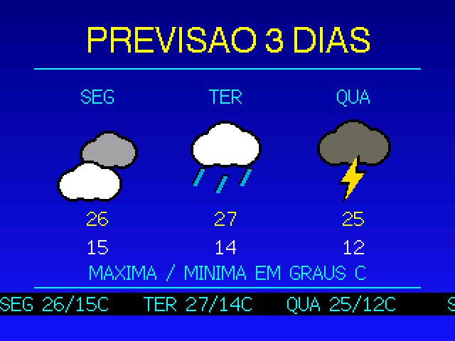
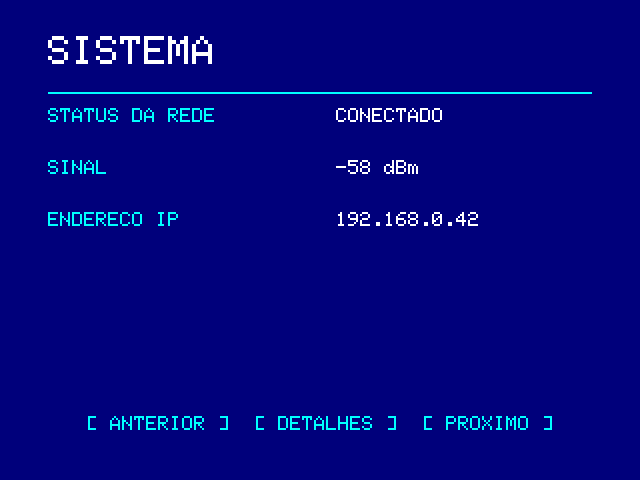

# M5 RETRO TV — Core2 + Module13.2 RCA M125

**[English](#english) · [Português](#português)**

Arduino/ESP32 firmware that turns an M5Stack Core2 with the Module13.2 RCA (M125)
into a retro TV: MJPEG + WAV playback from microSD over NTSC composite video, an
air-traffic radar, an iPod-style music player and a clone of the 1980s *Weather
Channel Local Forecast*.

*Firmware Arduino/ESP32 que transforma um M5Stack Core2 com o Module13.2 RCA
(M125) numa TV retrô: reprodução de MJPEG + WAV do microSD por vídeo composto
NTSC, radar de tráfego aéreo, player de música estilo iPod e um clone do "Local
Forecast" do Weather Channel dos anos 80.*

---

## Screens · Telas

320×240 renders, scaled 2×, produced by the SDL screen simulator in `sim/` —
the **same M5GFX rasterizer and the same bitmap fonts** the device uses, so they
are not mockups. Regenerate with `./sim/build/m5sim --png docs/screens`.

*Renders 320×240 (escalados 2×) gerados pelo simulador de telas em `sim/` — o
**mesmo rasterizador M5GFX e as mesmas fontes bitmap** do aparelho, portanto não
são mockups. Regenere com `./sim/build/m5sim --png docs/screens`.*

| Home · Início | Library · Biblioteca | Playback · Reprodução |
|---|---|---|
|  |  |  |

| Radar | Weather · Previsão | 3-day · 3 dias |
|---|---|---|
|  |  |  |

| Settings · Configurações | System · Sistema | Network · Rede |
|---|---|---|
|  |  |  |

| Music · Música | Now playing | Portal | Error · Erro |
|---|---|---|---|
|  |  |  |  |

---

# English

## Repository layout

- Root: the main player firmware (MJPEG/WAV + radar + portal). The LCD no longer
  mirrors the video, to free bandwidth on the shared SPI bus (microSD + ILI9342C):
  it shows a static poster plus a 1 Hz HUD (elapsed time and progress bar) drawn
  into a tiny `LGFX_Sprite`. Video goes out over RCA only.
- `weather/`: alternative firmware, a separate self-contained PlatformIO project —
  a clone of *The Weather Channel Local Forecast* (Open-Meteo + ticker + smooth
  jazz on loop). See `weather/README.md`.
- `sim/`: SDL screen simulator. Runs the same M5GFX rasterizer on the desktop.
- `AGENTS.md`: firmware architecture, non-negotiable hardware constraints and the
  traps that have already bitten. Start there before changing code.

## Composite output (RCA)

The signal is **NTSC** (525 lines, 59.94 Hz, black at 7.5 IRE). M5GFX's `PAL_M`
mode was abandoned because its signal table builds the line out of 908 samples,
while 4 × 3.57561149 MHz × 63.5556 µs gives 909.02: the line comes out ~0.11%
short, the colour burst phase walks line to line, and what you get on the TV is a
diagonal colour band crawling across the screen. The NTSC table uses 910 samples,
which is exact for 4 × 3.579545 MHz, so the burst stays stable. Brazilian CRT
sets with a composite input accept NTSC.

Every piece of text, rule and band drawn on the RCA output stays inside the
**safe area** (`crt::SAFE_*` in `include/SafeArea.h`): a 24 px horizontal and
18 px vertical margin, about 7% of each edge, which is what a CRT typically hides
to overscan. The background still fills the whole raster, so there are no black
bars. Video is centred in the 320×240 frame; on a CRT the outer edges of that
frame fall into the overscan, so media larger than roughly 272×204 loses its
extremities on screen — the converter's 240×160 default fits entirely.

## Building

Python 3.9 or newer and internet access are needed on the first build.

```sh
cd m5-retro-tv
python3 -m venv .venv
.venv/bin/pip install platformio==6.1.19
.venv/bin/pio run
```

`platformio.ini` pins the board and the dependency versions. `M5ModuleRCA.h` is
part of M5GFX. The resulting application file is
`.pio/build/m5stack-core2/firmware.bin`.

With the Core2 connected over USB:

```sh
.venv/bin/pio run --target upload
.venv/bin/pio device monitor
```

`firmware.bin` on its own is an application, not a full image to flash at address
zero; use the PlatformIO command so the correct bootloader and partition table
are applied too.

## Preparing videos

The player reads concatenated baseline JPEGs and 16-bit stereo 22,050 Hz PCM WAV.
It does not read MP4 directly. The bundled converter uses FFmpeg and FFprobe from
your PATH:

```sh
python3 tools/prepare_video.py /path/movie.mp4 /path/new-program --title "My film"
```

Copy the resulting folder to `M5RETRO/videos/new-program/` on a FAT32 card. It
contains:

```text
meta.json
video.mjpeg
audio.wav
```

The default is 240×160 at 15 fps, preserving aspect ratio with black bars. For a
higher resolution add `--size 320x240`. `--fps` accepts 10 to 30; `--quality`
goes from 2 to 15, lower values producing larger JPEGs. Real performance depends
on the card and the device; 320×240 at 30 fps is not a guaranteed rate — measure
it with `diag bench`.

The converter never replaces an existing folder. It validates size and frame
count, inserts silence when the video has no audio, and pads short audio to the
video duration. Each JPEG must be at most 128 KiB. `meta.json` is optional when
the files are named `video.mjpeg` and `audio.wav` and the rate is 15 fps.

## Music (MP3/WAV)

The home menu has a **MUSICA** entry, an iPod-style player that browses folders
on the card:

```text
/M5RETRO/music/
  Artist/
    Album/
      cover.jpg  (or folder.jpg)   <- album art, shown on the "now playing" screen
      track.mp3                    <- MP3 (128/192/320 kbps, 44100 Hz) via libhelix
      track.wav                    <- WAV PCM 16-bit 22050 Hz stereo
```

Supported: `.mp3` (decoded in software and resampled to 22050 Hz) and `.wav`
(PCM 16-bit stereo 22050 Hz). ID3v1/v2 tags (title/artist/album/year) appear on
screen, and accents are normalised to ASCII by `include/Ascii.h`. Album art comes
from `cover.jpg`/`folder.jpg` in the album folder or from the `APIC` frame
embedded in the MP3. Ready-made test files are in `test-music/` (with accents and
artwork) — copy them to `/M5RETRO/music/`.

## Controls

- Home screen: pick an item directly, or navigate with the three buttons.
- Every screen except home has a back arrow in the LCD's top-right corner.
- Player: left/right change program; centre, or a tap on the picture, pauses and
  resumes.
- The **AUDIO: M5 / RCA** button switches between the internal speaker and RCA
  audio during playback and saves the preference. Composite video stays active
  either way.
- Holding centre for 0.7 s and releasing returns to the library; 1.5 s returns
  home.
- In the library, every program is reachable in pages of four items.
- Volume from 0 to 100% works on both the RCA output and the internal speaker;
  there is also a mute mode.

The video clock follows the amount of PCM actually delivered. Late frames are
skipped without being decoded. The physical latency of the audio/video converters
has to be checked on the device.

## Configuration and network

Playback works without Wi-Fi. Under **CONFIGURAÇÕES → CONFIGURAR REDE**, connect
your phone to the network and password shown on the Core2 and open
`http://192.168.4.1`.

Leaving the password/token blank preserves the existing value for the same
network. The **REDE SEM SENHA** option clears the password for an open network.
The test button verifies the Wi-Fi connection; it does not claim that the
internet or the API work. The portal closes after ten idle minutes and returns to
the menu.

The radar API requires HTTPS. For TLS validation, put your server's CA
certificate at `M5RETRO/config/ca.pem`; the clock is synchronised over NTP. The
firmware embeds no credentials. `allow_insecure_tls` remains available in the
configuration file for compatibility only; certificate validation is the default.

The API may return an array, or an object with `items`/`aircraft`/`data`
containing an array. Numeric, valid latitude and longitude are mandatory.
Altitude and speed must be in feet and knots: field aliases do not convert units
between providers. The query runs in a separate task with bounded timeouts and
only starts on the radar screen. The response is applied by the interface; the
network task never draws. TLS buffers use PSRAM; the composite video buffer uses
SRAM so the output stays alive during the query. When the radar centre is still
0,0, the average of the received positions defines a temporary centre — that is
not the device's location. Set latitude/longitude to use your own position.

Preferences load even without `secrets.json`. Writes keep a `.bak` copy until the
swap succeeds, recovered on the next boot if needed. That protects an individual
file swap; it does not make two writes a transaction, nor does it eliminate
physical FAT card failures.

The weather screen uses **Open-Meteo** (`api.open-meteo.com`), a public API with
no key and an ~800-byte response.

## Tests

The native tests use a C++ compiler with AddressSanitizer/UndefinedBehaviorSanitizer:

```sh
./tests/run.sh
./tests/media.sh
```

`media.sh` also needs FFmpeg/FFprobe and the dependencies installed by `pio run`.
It generates two temporary synthetic videos, tests audio and silence, reads the
containers and decodes the frames with the same JPEGDEC pinned in the firmware.
It does not measure FPS and does not validate the Core2's analogue output.

## Screen simulator

`sim/` runs the **same M5GFX rasterizer** as the device, through an SDL backend,
on your desktop. It exists to check layout — above all whether anything escaped
the safe area — without hooking the Core2 to a TV.

```sh
make -C sim                     # build
make -C sim run                 # open the window
make -C sim cxx11               # compile shared headers as C++11
./sim/build/m5sim --png <dir>   # write all screens as PNG, headless
```

Keys: `←`/`→` or `1`–`9` switch screens, `G` toggles the safe-area guide, `ESC`
quits.

What it does **not** simulate: Wi-Fi, the SD card, I2S, MJPEG decoding, FreeRTOS,
touch, and anything from M5Unified. **It does not simulate performance either** —
it runs on your computer's CPU, so any FPS measured there is fiction. For
performance, use `diag bench` on the device.

The firmware compiles as C++11 and the simulator as C++17, so `make -C sim cxx11`
exists to catch constructs that pass on the desktop and break on the device.

## Schematik

After changing sources, run:

```sh
python3 tools/sync_schematik.py
python3 tools/sync_schematik.py --check
```

This updates the embedded code and the library versions in
`schematik-project.json`. `./tests/run.sh` fails if it is out of sync. Import and
flashing through the Schematik interface have not been verified on this machine;
the build was validated with PlatformIO.

## USB diagnostics

Serial at 115200 baud: `diag status`, `diag colors`, `diag play`, `diag pause`,
`diag resume`, `diag stop`, `diag back`, `diag home`, `diag radar`,
`diag weather`, `diag music`, `diag bench` and `diag audio toggle`. The last one
uses the same routine as the player button. The status line reports audio output,
errors, PCM samples, dropped frames, heap and HTTP result, without printing
credentials.

### Video benchmark

`diag bench` measures, on the device itself, how far the Core2 sustains the
composite output. It times the three stages separately in microseconds, running
as fast as possible, with no audio pacing and no frame dropping:

```text
diag bench                                  # selected program, 150 frames
diag bench 400                              # selected program, 400 frames
diag bench /M5RETRO/videos/my-film          # given folder
diag bench /M5RETRO/videos/my-film 400      # given folder, 400 frames
```

The report covers card reads (average, worst case and MB/s), JPEG decoding with
the blit already subtracted, the blit into the CVBS framebuffer, whole-frame time
and the sustained FPS. To compare resolutions, prepare the same media at
`240x160` and at `320x240` and run the command on both folders.

The quality ceiling of the RCA output is set by the signal, not by the device:
NTSC delivers 59.94 fields per second and the luminance has about 4.2 MHz of
bandwidth, equivalent to ~330 points per line. Above **320×240 at 30 fps** there
is no detail to gain on a CRT — only extra work. At 640×480 the framebuffer would
exceed 307 KiB, would not fit in the ESP32's internal SRAM, and would have to
move to PSRAM, which is too slow for the per-scanline deadline. The benchmark
tells you whether the Core2 reaches that ceiling with your media, not how to
exceed it.

### Player OSD and weather screen

The player's OSD imitates a 1990s Sony/Semp VCR: text floats over the picture
with no background band, each glyph carries a black outline, the transport symbol
is drawn as a shape (never the word "PLAY") and the tape counter uses large
digits. The typeface is `include/VcrFont.h`, a 12×16 bitmap font with a constant
2 px stroke: M5GFX's own fonts have a 1 px stroke and vanish into NTSC's
horizontal smear. The font is ASCII — no accents, like the character generators
of the period — and all text passes through `ascii::normalizeUpper` before being
drawn.

The weather screen alternates two pages every 10 s — current conditions and the
three-day forecast — with Weather Star 4000 transitions: a vertical wipe when new
data arrives and a horizontal slide when the page changes
(`include/ScreenFx.h`). The fades use ordered Bayer dithering, not alpha
blending: the composite framebuffer has no alpha channel and there is no SRAM
headroom for two whole frames. Condition icons (`include/WeatherIcons.h`) are
chosen by Open-Meteo's WMO code, not by matching text.

### Memory budget

The scarce resource is **not PSRAM** — it is internal SRAM. The composite video
framebuffer takes 320×240 at 16 bits = **153,600 bytes of SRAM**, and
`M5ModuleRCA` is constructed with `psram_no_use` on purpose: PSRAM is too slow
for NTSC's per-scanline deadline. Moving the framebuffer there would free 150 KB
and break the video.

Out of PSRAM (4.5 MB) come the JPEG buffer (`MAX_JPEG`, 128 KiB), the TLS buffers
and the artwork and HUD sprites — under 3% of the total. There is nothing to save
there, and saving it would gain nothing.

The colour test checks the native RGB565 path used by the JPEG blocks. Visually
inspecting the picture and measuring the RCA outputs require physical
observation and connection.

See `PLANO_E_REVISAO.md` for the problems found, the steps taken and the physical
test plan. `PINOUT.md` describes the connections the code uses.

---

# Português

## Estrutura do repositório

- Raiz: firmware principal do player (MJPEG/WAV + radar + portal). O LCD deixou de
  espelhar o vídeo para liberar a banda do SPI compartilhado (microSD + ILI9342C):
  ele mostra um pôster estático + um HUD de 1 Hz (tempo e barra de progresso) via um
  `LGFX_Sprite` minúsculo. O vídeo sai somente pela RCA.
- `weather/`: firmware alternativo, projeto PlatformIO separado — clone do
  "The Weather Channel Local Forecast" (Open-Meteo + ticker + smooth jazz em loop).
  Consulte `weather/README.md`.
- `sim/`: simulador SDL das telas. Roda o mesmo rasterizador M5GFX no desktop.
- `AGENTS.md`: arquitetura do firmware, restrições de hardware que não são
  negociáveis e as armadilhas já conhecidas. É o ponto de partida para quem for
  mexer no código.

## Saída composta (RCA)

O sinal é **NTSC** (525 linhas, 59,94 Hz, preto em 7,5 IRE). O modo `PAL_M` do
M5GFX foi abandonado porque a tabela de sinal dele monta a linha com 908
amostras, enquanto 4 × 3,57561149 MHz × 63,5556 µs dá 909,02: a linha sai ~0,11%
curta, a fase da burst de cor anda a cada linha e o resultado na TV é uma faixa
de cor diagonal caminhando pela tela. A tabela NTSC usa 910 amostras, valor
exato para 4 × 3,579545 MHz, então a burst fica estável. TVs brasileiras de tubo
com entrada de vídeo composto aceitam NTSC.

Todo o texto, régua e faixa desenhados na RCA ficam dentro da **área segura**
(`crt::SAFE_*` em `include/SafeArea.h`): margem de 24 px na horizontal e 18 px na
vertical, ou seja ~7% de cada borda, que é o que um tubo tipicamente esconde por
overscan. O fundo continua preenchendo o raster inteiro, então não aparecem
tarjas pretas. Vídeos continuam sendo centralizados no quadro de 320×240; num
tubo as bordas externas desse quadro caem no overscan, então mídia acima de
~272×204 perde as extremidades na tela — o padrão de 240×160 do conversor cabe
inteiro.

## Compilar

Python 3.9 ou superior e acesso à internet são necessários na primeira compilação.

```sh
cd m5-retro-tv
python3 -m venv .venv
.venv/bin/pip install platformio==6.1.19
.venv/bin/pio run
```

`platformio.ini` fixa a placa e as versões das dependências. O arquivo
`M5ModuleRCA.h` faz parte de M5GFX. O arquivo de aplicação resultante é
`.pio/build/m5stack-core2/firmware.bin`.

Com o Core2 conectado por USB, o comando de gravação é:

```sh
.venv/bin/pio run --target upload
.venv/bin/pio device monitor
```

O `firmware.bin` isolado é uma aplicação, não uma imagem completa para gravar no
endereço zero; use o comando PlatformIO para aplicar também bootloader e
partições corretos.

## Preparar vídeos

O player lê JPEGs baseline concatenados e WAV PCM de 16 bits, estéreo, 22.050 Hz.
Não lê MP4 diretamente. O conversor incluído usa FFmpeg e FFprobe instalados no PATH:

```sh
python3 tools/prepare_video.py /caminho/filme.mp4 /caminho/novo-programa --title "Meu filme"
```

Copie a pasta criada para `M5RETRO/videos/novo-programa/` no cartão FAT32. Ela contém:

```text
meta.json
video.mjpeg
audio.wav
```

O padrão é 240×160, 15 quadros/s, preservando proporção com barras pretas. Para
experimentar maior resolução, acrescente `--size 320x240`. `--fps` aceita 10 a
30; `--quality` vai de 2 a 15, com valores menores produzindo JPEGs maiores. O
desempenho real depende do cartão e do aparelho; 320×240/30 FPS não é uma taxa
garantida — meça com `diag bench`.

O conversor não substitui pastas existentes. Ele valida tamanho e quantidade de
quadros, inclui silêncio quando o vídeo não tem áudio e completa áudio curto até
a duração do vídeo. Cada JPEG deve ter no máximo 128 KiB. `meta.json` é opcional
quando os arquivos se chamam `video.mjpeg` e `audio.wav` e a taxa é 15 FPS.

## Música (MP3/WAV)

O menu inicial tem o item **MUSICA**, um player estilo iPod que navega por pastas do SD:

```text
/M5RETRO/music/
  Artista/
    Album/
      cover.jpg  (ou folder.jpg)   <- capa do álbum, exibida na tela "now playing"
      faixa.mp3                    <- MP3 (128/192/320 kbps, 44100 Hz) via libhelix
      faixa.wav                    <- WAV PCM 16-bit 22050 Hz estéreo
```

Formato suportado: `.mp3` (decodificado por software e reamostrado para 22050 Hz)
e `.wav` (PCM 16-bit estéreo 22050 Hz). As tags ID3v1/v2 (título/artista/álbum/ano)
aparecem na tela, e os acentos são normalizados para ASCII por `include/Ascii.h`.
A capa vem de `cover.jpg`/`folder.jpg` na pasta do álbum ou do frame `APIC`
embutido no MP3. Arquivos de teste prontos estão em `test-music/` (com acentos e
capa) — copie para `/M5RETRO/music/`.

## Controles

- Tela inicial: selecionar diretamente um item ou navegar com os três botões.
- Todas as telas, exceto a inicial, têm uma seta de voltar no canto superior
  direito do LCD.
- Player: esquerda/direita trocam o programa; centro ou toque na imagem
  pausa/continua.
- O botão **AUDIO: M5 / RCA** alterna o alto-falante interno e o áudio RCA
  durante a reprodução e salva a preferência. O vídeo composto permanece ativo em
  ambas as opções.
- Segurar o centro por 0,7 s e soltar volta à biblioteca; por 1,5 s volta ao início.
- Na biblioteca, todos os programas ficam acessíveis em páginas de quatro itens.
- Volume de 0 a 100% funciona na saída RCA e no alto-falante interno; também
  existe modo mudo.

O relógio de vídeo segue a quantidade de PCM entregue. Quadros atrasados são
pulados sem decodificar. A latência física dos conversores de áudio/vídeo deve
ser conferida no aparelho.

## Configuração e rede

A reprodução funciona sem Wi-Fi. Em **CONFIGURAÇÕES → CONFIGURAR REDE**, conecte
o celular à rede e senha exibidas no Core2 e abra `http://192.168.4.1`.

Deixar senha/token em branco preserva o valor existente da mesma rede. A opção
**REDE SEM SENHA** limpa a senha para uma rede aberta. O teste verifica a conexão
Wi-Fi; não afirma que a internet ou a API funcionam. O botão de teste mantém o
formulário preenchido. O portal fecha após dez minutos sem atividade e retorna ao
menu.

A API do radar exige HTTPS. Para validação de TLS, coloque o certificado CA do
seu servidor em `M5RETRO/config/ca.pem`; o relógio é sincronizado por NTP. O
firmware não embute credenciais. `allow_insecure_tls` continua disponível apenas
no arquivo de configuração por compatibilidade; a validação de certificado é o
padrão.

A API pode retornar um array ou um objeto com `items`/`aircraft`/`data` contendo
um array. Coordenadas numéricas e válidas de latitude e longitude são
obrigatórias. Altitude e velocidade devem estar em pés e nós: aliases de campos
não convertem automaticamente unidades de provedores diferentes. A consulta roda
em uma tarefa separada, com timeouts limitados, e começa apenas na tela de radar.
A resposta é aplicada pela interface, sem desenhar a tela a partir da tarefa de
rede. Os buffers TLS usam PSRAM; o buffer de vídeo composto usa SRAM para manter
a saída ativa durante a consulta. Quando o centro do radar ainda é 0,0, a média
das posições recebidas define o centro temporário; ela não é a localização do
dispositivo. Configure latitude/longitude para usar sua posição.

Preferências são carregadas mesmo sem `secrets.json`. Gravações mantêm uma cópia
`.bak` até a troca bem-sucedida, recuperada no próximo início se necessário. Isso
protege a troca individual de arquivos; não transforma duas gravações em uma
transação nem elimina falhas físicas do cartão FAT.

A tela de previsão usa a **Open-Meteo** (`api.open-meteo.com`), API pública, sem
chave, com resposta de ~800 bytes.

## Testes

Os testes nativos usam um compilador C++ com AddressSanitizer/UndefinedBehaviorSanitizer:

```sh
./tests/run.sh
./tests/media.sh
```

`media.sh` também exige FFmpeg/FFprobe e as dependências instaladas por `pio run`.
Gera dois vídeos sintéticos temporários, testa áudio e silêncio, lê os contêineres
e decodifica os quadros com a mesma JPEGDEC fixada no firmware. Não mede FPS nem
valida saída analógica do Core2.

## Simulador de telas

`sim/` roda o **mesmo rasterizador M5GFX** do aparelho, via backend SDL, no
desktop. Existe para conferir diagramação — sobretudo se algo escapou da área
segura — sem ligar o Core2 na TV.

```sh
make -C sim                     # compilar
make -C sim run                 # abrir a janela
make -C sim cxx11               # headers compartilhados em C++11
./sim/build/m5sim --png <dir>   # gravar todas as telas em PNG, headless
```

Teclas: `←`/`→` ou `1`–`9` trocam de tela, `G` liga/desliga a guia de área
segura, `ESC` fecha.

O que ele **não** simula: Wi-Fi, cartão SD, I2S, decodificação MJPEG, FreeRTOS,
touch, e nada do M5Unified. **E não simula desempenho** — ele roda na CPU do seu
computador, então qualquer FPS medido ali é ficção. Para desempenho, `diag bench`
no aparelho.

O firmware compila em C++11 e o simulador em C++17, então o `make -C sim cxx11`
existe para pegar construções que passam no desktop e quebram no aparelho.

## Schematik

Depois de alterar fontes, execute:

```sh
python3 tools/sync_schematik.py
python3 tools/sync_schematik.py --check
```

Isso atualiza o código incorporado e as versões das bibliotecas em
`schematik-project.json`. O `./tests/run.sh` falha se estiver dessincronizado. A
importação/gravação pela interface do Schematik não foi verificada nesta máquina;
a compilação foi validada pelo PlatformIO.

## Diagnóstico USB

Serial a 115200 baud: `diag status`, `diag colors`, `diag play`, `diag pause`,
`diag resume`, `diag stop`, `diag back`, `diag home`, `diag radar`,
`diag weather`, `diag music`, `diag bench` e `diag audio toggle`. O último comando
usa a mesma rotina do botão do player. O status informa saída de áudio, erros,
amostras PCM, quadros descartados, heap e resultado HTTP, sem imprimir
credenciais.

### Benchmark de vídeo

`diag bench` mede, no próprio aparelho, até onde o Core2 sustenta a saída
composta. Mede as três etapas separadamente em microssegundos, rodando o mais
rápido possível, sem cadência de áudio e sem descarte de quadros:

```text
diag bench                                  # programa selecionado, 150 quadros
diag bench 400                              # programa selecionado, 400 quadros
diag bench /M5RETRO/videos/meu-filme        # pasta indicada
diag bench /M5RETRO/videos/meu-filme 400    # pasta indicada, 400 quadros
```

O relatório traz leitura do cartão (média, pior caso e MB/s), decodificação
JPEG já descontado o blit, blit no framebuffer CVBS, tempo do quadro inteiro e
o FPS sustentado. Para comparar resoluções, prepare a mesma mídia em `240x160`
e em `320x240` e rode o comando nas duas pastas.

O teto de qualidade da RCA não é do aparelho, é do sinal: o NTSC entrega 59,94
campos por segundo e a luminância tem cerca de 4,2 MHz de banda, o equivalente a
~330 pontos por linha. Acima de **320×240 a 30 quadros/s** não há detalhe a
ganhar num tubo — só trabalho a mais. Em 640×480 o framebuffer passaria de
307 KiB, não caberia na SRAM interna do ESP32 e teria de ir para a PSRAM, que é
lenta demais para o prazo por linha de varredura. O benchmark serve para saber
se o Core2 alcança esse teto com a sua mídia, não para ultrapassá-lo.

### OSD do player e tela de previsão

O OSD do player imita o de um videocassete Sony/Semp dos anos 90: texto flutua
sobre a imagem sem tarja de fundo, com contorno preto por glifo, símbolo de
transporte desenhado como forma (nunca a palavra "PLAY") e contador de fita em
dígitos grandes. A tipografia é a `include/VcrFont.h`, uma fonte bitmap 12×16 de
traço constante de 2 px: as fontes do M5GFX têm traço de 1 px e somem no borrão
horizontal do NTSC. A fonte é ASCII (sem acentos, como os geradores de caractere
da época); todo texto passa por `ascii::normalizeUpper` antes de ser desenhado.

A tela de previsão alterna duas páginas a cada 10 s — condições atuais e previsão
de três dias — com as transições do Weather Star 4000: cortina vertical quando
chegam dados novos e deslizamento horizontal na troca de página
(`include/ScreenFx.h`). Os esmaecimentos usam dithering ordenado de Bayer, não
mistura por alfa: o framebuffer composto não tem canal alfa e não há folga de
SRAM para dois quadros inteiros. Os ícones de condição (`include/WeatherIcons.h`)
são escolhidos pelo código WMO da Open-Meteo, não pelo texto.

### Orçamento de memória

O recurso apertado **não é a PSRAM** — é a SRAM interna. O framebuffer do vídeo
composto ocupa 320×240 a 16 bits = **153.600 bytes de SRAM**, e o `M5ModuleRCA`
é construído com `psram_no_use` de propósito: a PSRAM é lenta demais para o
prazo por linha de varredura do NTSC. Mover o framebuffer para lá liberaria
150 KB e quebraria o vídeo.

Da PSRAM (4,5 MB) saem o buffer de JPEG (`MAX_JPEG`, 128 KiB), os buffers do
TLS e os sprites de capa e do HUD — menos de 3% do total. Não há o que economizar
ali, e economizar não renderia nada.

O teste de cores confere o caminho RGB565 nativo usado pelos blocos JPEG. A
conferência visual da imagem e a medição das saídas RCA exigem observação e
conexão física.

Consulte `PLANO_E_REVISAO.md` para os problemas encontrados, as etapas executadas
e o roteiro de teste físico. `PINOUT.md` descreve as conexões utilizadas pelo código.
