# M5 RETRO TV — Core2 + Module13.2 RCA M125

Firmware Arduino/ESP32 para reprodução de MJPEG + WAV no cartão microSD, saída composta NTSC,
pôster estático no LCD e consulta de tráfego aéreo por HTTPS. Interface em português.

## Estrutura do repositório

- Raiz: firmware principal do player (MJPEG/WAV + radar + portal). O LCD deixou de
  espelhar o vídeo para liberar a banda do SPI compartilhado (microSD + ILI9342C):
  ele mostra um pôster estático + um HUD de 1 Hz (tempo e barra de progresso) via um
  `LGFX_Sprite` minúsculo. O vídeo sai somente pela RCA.
- `weather/`: firmware alternativo, projeto PlatformIO separado — clone do
  "The Weather Channel Local Forecast" (Open-Meteo + ticker + smooth jazz em loop).
  Consulte `weather/README.md`.

## Telas

> Renders 320×240 (escalados 2×) gerados a partir do código de desenho em
> `tools/render_screens.py`. Substitua por capturas reais do Core2 quando o
> aparelho estiver conectado via USB.

| Início | Biblioteca | Reprodução |
|---|---|---|
| 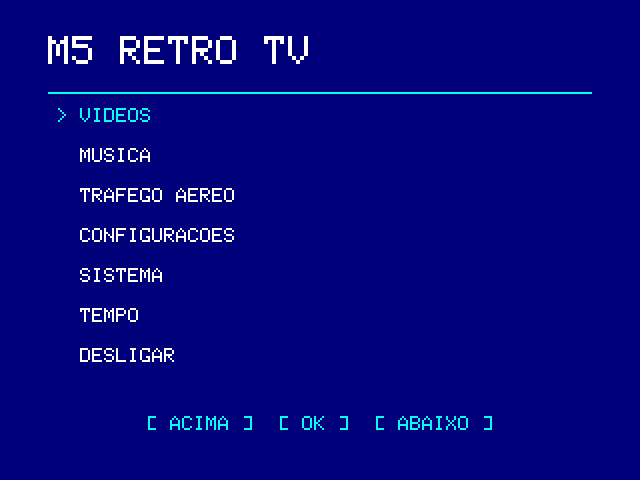 | 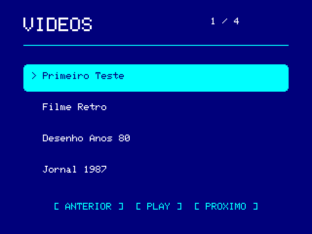 | 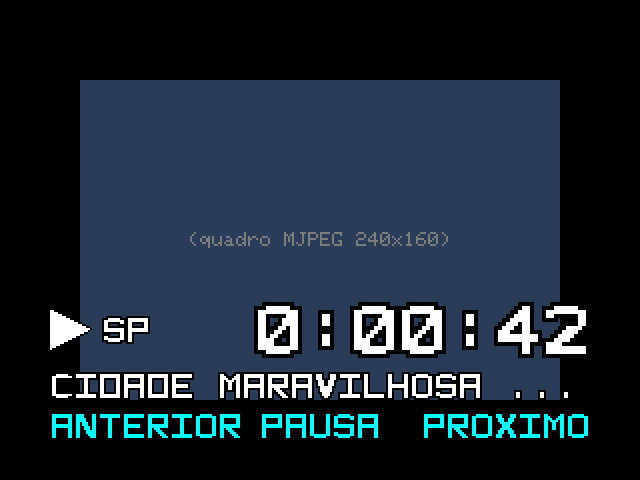 |

| Radar | Configurações | Sistema |
|---|---|---|
| 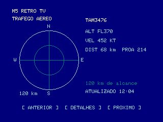 | 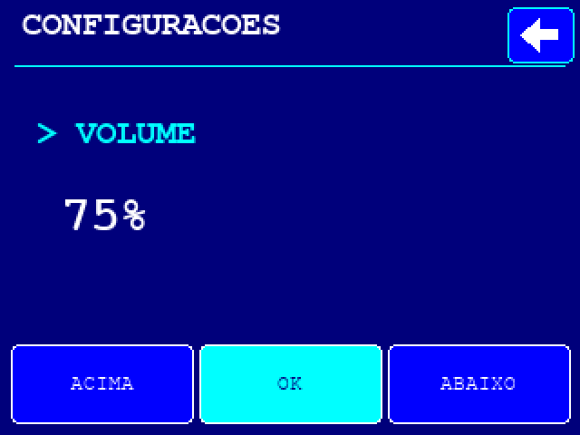 | 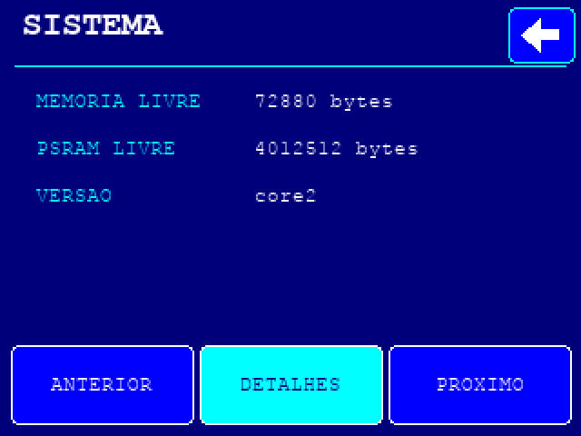 |

| Portal | Erro | Weather Channel |
|---|---|---|
| 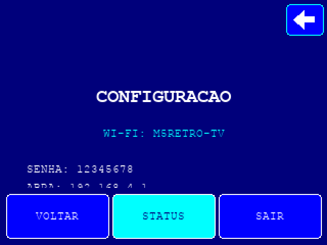 | 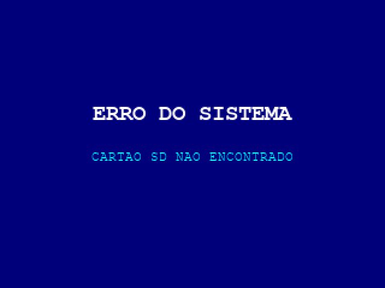 | 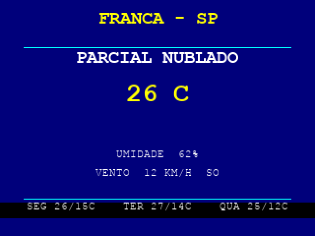 |

| Música | Now Playing (capa + ID3) |
|---|---|
| 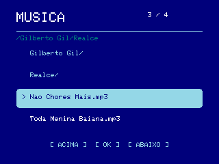 | 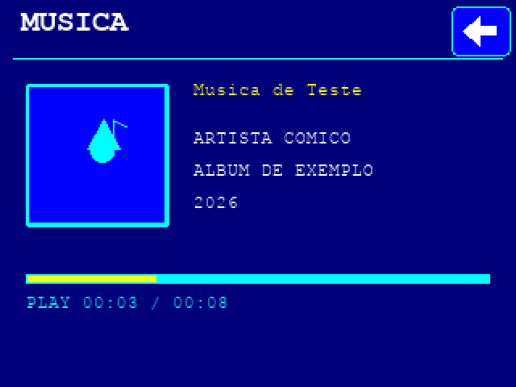 |

## Saída composta (RCA)

O sinal é **NTSC** (525 linhas, 59,94 Hz, preto em 7,5 IRE). O modo `PAL_M` do
M5GFX foi abandonado porque a tabela de sinal dele monta a linha com 908
amostras, enquanto 4 × 3,57561149 MHz × 63,5556 µs dá 909,02: a linha sai ~0,11%
curta, a fase da burst de cor anda a cada linha e o resultado na TV é uma faixa
de cor diagonal caminhando pela tela. A tabela NTSC usa 910 amostras, valor
exato para 4 × 3,579545 MHz, então a burst fica estável. TVs brasileiras de tubo
com entrada de vídeo composto aceitam NTSC.

Todo o texto, régua e faixa desenhados na RCA ficam dentro da **área segura**
(`SAFE_*` em `src/main.cpp`): margem de 24 px na horizontal e 18 px na vertical,
ou seja ~7% de cada borda, que é o que um tubo tipicamente esconde por overscan.
O fundo continua preenchendo o raster inteiro, então não aparecem tarjas pretas.
Vídeos continuam sendo centralizados no quadro de 320×240; num tubo as bordas
externas desse quadro caem no overscan, então mídia acima de ~272×204 perde as
extremidades na tela — o padrão de 240×160 do conversor cabe inteiro.

## Compilar

Python 3.9 ou superior e acesso à internet são necessários na primeira compilação.

```sh
cd /Users/eliel/Documents/TV
python3 -m venv .venv
.venv/bin/pip install platformio==6.1.19
.venv/bin/pio run
```

`platformio.ini` fixa a placa e as versões das dependências. O arquivo `M5ModuleRCA.h` faz parte de M5GFX.
O arquivo de aplicação resultante é `.pio/build/m5stack-core2/firmware.bin`.

Com o Core2 conectado por USB, o comando de gravação é:

```sh
.venv/bin/pio run --target upload
.venv/bin/pio device monitor
```

A gravação por USB foi executada no Core2 em 20/09/2026, com verificação da imagem gravada.
O `firmware.bin` isolado é uma aplicação, não uma imagem completa para gravar no endereço zero;
use o comando PlatformIO para aplicar também bootloader e partições corretos.

## Preparar vídeos

O player lê JPEGs baseline concatenados e WAV PCM de 16 bits, estéreo, 22.050 Hz.
Não lê MP4 diretamente. O conversor incluído usa FFmpeg e FFprobe instalados no PATH:

```sh
python3 tools/prepare_video.py /caminho/filme.mp4 /caminho/novo-programa --title "Meu filme"
```

Copie a pasta criada para `M5RETRO/videos/novo-programa/` no cartão FAT32. Ela contém:

```text
meta.json
video.mjpeg
audio.wav
```

O padrão é 240×160, 15 quadros/s, preservando proporção com barras pretas. Para experimentar
maior resolução, acrescente `--size 320x240`. `--fps` aceita 10 a 30; `--quality` vai de 2 a 15,
com valores menores produzindo JPEGs maiores. O desempenho real depende do cartão e do aparelho;
320×240/30 FPS não é uma taxa garantida.

O conversor não substitui pastas existentes. Ele valida tamanho e quantidade de quadros, inclui
silêncio quando o vídeo não tem áudio e completa áudio curto até a duração do vídeo.
Cada JPEG deve ter no máximo 128 KiB. `meta.json` é opcional quando os arquivos se chamam
`video.mjpeg` e `audio.wav` e a taxa é 15 FPS.

## Música (MP3/WAV)

O menu inicial tem o item **MUSICA**, um player estilo iPod que navega por pastas do SD:

```text
/M5RETRO/music/
  Artista/
    Album/
      cover.jpg  (ou folder.jpg)   <- capa do álbum, exibida na tela "now playing"
      faixa.mp3                    <- MP3 (128/192/320 kbps, 44100 Hz) via libhelix
      faixa.wav                    <- WAV PCM 16-bit 22050 Hz estéreo
```

Formato suportado: `.mp3` (decodificado por software e reamostrado para 22050 Hz) e `.wav`
(PCM 16-bit estéreo 22050 Hz). As tags ID3v1/v2 (título/artista/álbum/ano) aparecem na tela, e os
acentos são normalizados para ASCII por `include/Ascii.h`. A capa vem de `cover.jpg`/`folder.jpg`
na pasta do álbum ou do frame `APIC` embutido no MP3. Arquivos de teste prontos estão em
`test-music/` (com acentos e capa) — copie para `/M5RETRO/music/`.

## Controles

- Tela inicial: selecionar diretamente um item ou navegar com os três botões.
- Todas as telas, exceto a inicial, têm uma seta de voltar no canto superior direito do LCD.
- Player: esquerda/direita trocam o programa; centro ou toque na imagem pausa/continua.
- O botão **AUDIO: M5 / RCA** alterna o alto-falante interno e o áudio RCA durante a reprodução e salva a preferência. O vídeo composto permanece ativo em ambas as opções.
- Segurar o centro por 0,7 s e soltar volta à biblioteca; por 1,5 s volta ao início.
- Na biblioteca, todos os programas ficam acessíveis em páginas de quatro itens.
- Volume de 0 a 100% funciona na saída RCA e no alto-falante interno; também existe modo mudo.
- A opção **PRÉVIA LCD** troca a frequência da prévia. A resolução do vídeo vem do arquivo;
  essa opção não converte nem aumenta a resolução da mídia.

O relógio de vídeo segue a quantidade de PCM entregue com cadência temporal. Quadros atrasados
são pulados sem decodificar; a prévia LCD pode atualizar menos que a TV para reduzir carga.
A latência física dos conversores de áudio/vídeo deve ser conferida no aparelho.

## Configuração e rede

A reprodução funciona sem Wi-Fi. Em **CONFIGURAÇÕES → CONFIGURAR REDE**, conecte o celular à
rede e senha exibidas no Core2 e abra `http://192.168.4.1`.

Deixar senha/token em branco preserva o valor existente da mesma rede. A opção **REDE SEM SENHA**
limpa a senha para uma rede aberta. O teste verifica a conexão Wi-Fi; não afirma que a internet
ou a API funcionam. O botão de teste mantém o formulário preenchido. O portal fecha após dez
minutos sem atividade e retorna ao menu.

A API exige HTTPS. Para validação de TLS, coloque o certificado CA do seu servidor em
`M5RETRO/config/ca.pem`; o relógio é sincronizado por NTP. O firmware não embute credenciais.
`allow_insecure_tls` continua disponível apenas no arquivo de configuração por compatibilidade;
a validação de certificado é o padrão.

A API pode retornar um array ou um objeto com `items`/`aircraft`/`data` contendo um array. Coordenadas
numéricas e válidas de latitude e longitude são obrigatórias. Altitude e velocidade devem estar
em pés e nós: aliases de campos não convertem automaticamente unidades de provedores diferentes.
A consulta roda em uma tarefa separada, com timeouts limitados, e começa apenas na tela de radar.
A resposta é aplicada pela interface, sem desenhar a tela a partir da tarefa de rede.
Os buffers TLS usam PSRAM; o buffer de vídeo composto usa SRAM para manter a saída ativa durante a consulta.
O MeuLabApp usa `/api/adsb/aircraft`, autenticação Bearer e os campos `items`, `speed_kt` e `model`.
Quando o centro do radar ainda é 0,0, a média das posições recebidas define o centro temporário;
ela não é a localização do dispositivo. Configure latitude/longitude para usar sua posição.

Preferências são carregadas mesmo sem `secrets.json`. Gravações mantêm uma cópia `.bak` até a troca
bem-sucedida, recuperada no próximo início se necessário. Isso protege a troca individual de
arquivos; não transforma duas gravações em uma transação nem elimina falhas físicas do cartão FAT.

## Schematik

Depois de alterar fontes, execute:

```sh
python3 tools/sync_schematik.py
python3 tools/sync_schematik.py --check
```

Isso atualiza o código incorporado e as versões das bibliotecas em `schematik-project.json`.
Abra esse arquivo atualizado no Schematik. A importação/gravação pela interface do Schematik
não foi verificada nesta máquina; a compilação foi validada pelo PlatformIO.

## Testes

Os testes nativos usam um compilador C++ com AddressSanitizer/UndefinedBehaviorSanitizer:

```sh
./tests/run.sh
./tests/media.sh
```

`media.sh` também exige FFmpeg/FFprobe e as dependências instaladas por `pio run`. Gera dois vídeos
sintéticos temporários, testa áudio e silêncio, lê os contêineres e decodifica os quadros com a
mesma JPEGDEC fixada no firmware. Não mede FPS nem valida saída analógica do Core2.

Consulte `PLANO_E_REVISAO.md` para os problemas encontrados, as etapas executadas e o roteiro
de teste físico. `PINOUT.md` descreve as conexões utilizadas pelo código.

## Diagnóstico USB

Serial a 115200 baud: `diag status`, `diag colors`, `diag play`, `diag pause`, `diag resume`,
`diag stop`, `diag back`, `diag home`, `diag radar`, `diag weather`, `diag music` e
`diag audio toggle`. O último comando usa
a mesma rotina do botão do player. O status informa saída de áudio, erros, amostras PCM,
quadros descartados, heap e resultado HTTP, sem imprimir credenciais.

O teste de cores confere o caminho RGB565 nativo usado pelos blocos JPEG. A conferência visual
da imagem e a medição das saídas RCA exigem observação/conexão física.
